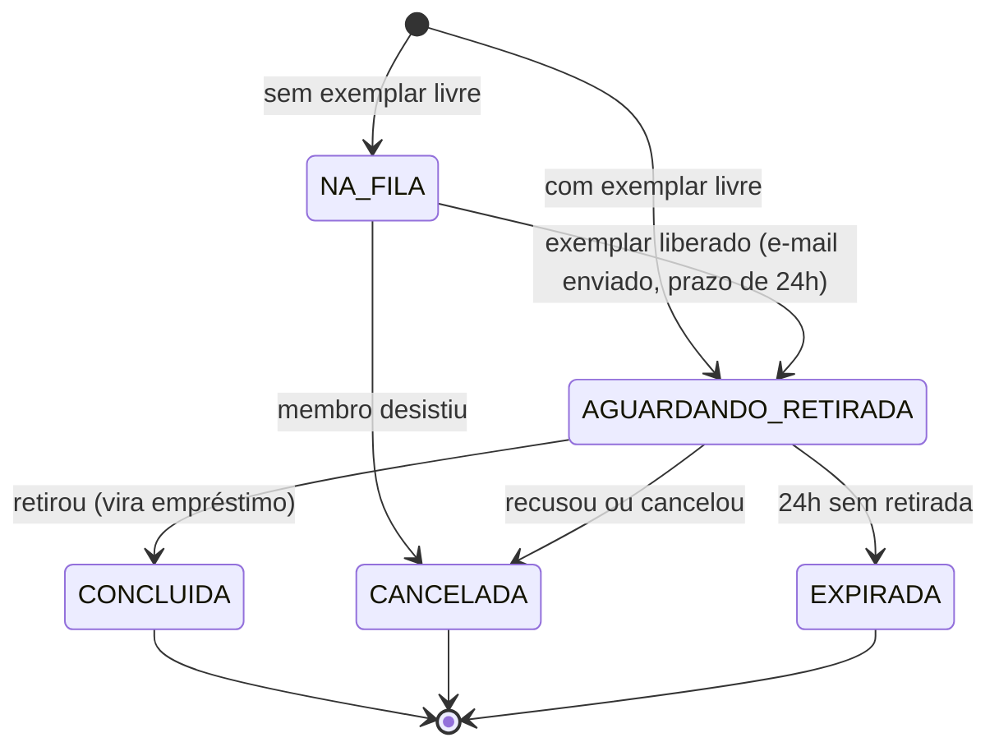

# 📚 Biblioteca Comunitária FLUI

Sistema web de gestão de acervo, empréstimos e reservas para a Biblioteca Comunitária FLUI. Projeto estudantil desenvolvido em **Django** (arquitetura **MVT**), com deploy no **PythonAnywhere**.

> 🚧 **Projeto em desenvolvimento.** O núcleo administrativo (acervo, membros e empréstimos) já está em produção. Portal público, fila de espera, restrições e auditoria estão sendo construídos em sprints até **17/12/2026**. A seção [Status do projeto](#-status-do-projeto) mostra o que já existe e o que está planejado.

<!-- Sugestão: adicione aqui o selo do CI depois da tarefa GOV-03 -->
<!--  -->

## Sumário

- [Sobre o projeto](#-sobre-o-projeto)
- [Status do projeto](#-status-do-projeto)
- [Funcionalidades](#-funcionalidades)
- [Arquitetura](#-arquitetura)
- [Modelos de dados](#-modelos-de-dados)
- [Fluxo de reservas e fila de espera](#-fluxo-de-reservas-e-fila-de-espera)
- [Tecnologias](#-tecnologias)
- [Como rodar localmente](#-como-rodar-localmente)
- [Variáveis de ambiente](#-variáveis-de-ambiente)
- [Testes](#-testes)
- [Ambientes e deploy](#-ambientes-e-deploy)
- [Como contribuir](#-como-contribuir)
- [Segurança e LGPD](#-segurança-e-lgpd)
- [Documentação](#-documentação)
- [Equipe](#-equipe)

---

## 📖 Sobre o projeto

A Biblioteca Comunitária FLUI precisa controlar o acervo, quem pegou cada livro e quando ele deve voltar. Este sistema automatiza esse controle: o estoque se atualiza sozinho a cada empréstimo e devolução, e as regras de negócio (quem pode pegar livro, quanto tempo pode ficar com ele) ficam protegidas na camada de modelos, antes de qualquer dado chegar ao banco.

O projeto segue o princípio de **separação de responsabilidades**: regras de negócio e validação no `models.py`, apresentação nos templates, e coordenação nas views.

---

## 🧭 Status do projeto

| Área | Situação |
|---|---|
| Acervo (Livro, Autor, Categoria) | ✅ Em produção |
| Membros (Aluno e Professor) e Empréstimos, com controle automático de estoque | ✅ Em produção |
| Painel administrativo (Django Admin) | ✅ Em produção (em enriquecimento contínuo) |
| Curso e período do aluno; e-mail e nome completo do professor | 🔜 Sprint 1 |
| Portal público: layout, login, catálogo, detalhe do livro, "Minha conta" | 🔜 Sprints 1 a 3 |
| Bloqueio por pendência, marcação automática de atrasos, renovação | 🔜 Sprints 2 e 3 |
| Reservas, fila de espera e e-mails de aceite/recusa | 🔜 Sprints 1 a 4 |
| Trilha de auditoria e conferência de inventário | 🔜 Sprints 2 e 3 |
| Ambiente de homologação, CI e configuração segura | 🔜 Sprints 0 a 2 |
| Otimização de consultas e revisão de segurança | 🔜 Sprint 4 |

O planejamento detalhado, com tarefas, responsáveis e datas, está em [`BACKLOG_FLUI.md`](BACKLOG_FLUI.md).

---

## ✨ Funcionalidades

### Já disponíveis

- **Cadastro de acervo** com categorias, autores (muitos-para-muitos) e controle de `qtd_total` e `qtd_disponivel`.
- **Cadastro de membros** com validação por perfil: alunos exigem **RA**; professores exigem **SIAPE**.
- **Empréstimos como máquina de estados** (Emprestado, Devolvido, Atrasado): ao salvar, o sistema baixa ou devolve unidades ao estoque automaticamente.
- **Prazo de devolução automático** de 7, 14 ou 28 dias, conforme o perfil do membro.
- **Bloqueio de empréstimo** de livros com estoque zerado.

### Em desenvolvimento

- **Portal do usuário:** login, catálogo em tempo real com busca, filtros e paginação, detalhe do livro e painel "Minha conta" (empréstimos ativos, histórico e reservas).
- **Fila de espera inteligente:** quando um livro sem exemplares é devolvido, o próximo da fila é avisado por e-mail, com opção de **aceitar ou recusar**, e tem **24 horas** para retirar (SLA de retirada).
- **Motor de restrições:** membros com devolução pendente ficam impedidos de novos empréstimos; empréstimos vencidos são marcados como atrasados automaticamente; renovação com **limite máximo de 1 mês**.
- **Governança:** trilha de auditoria global (quem mudou o quê e quando) e módulo de conferência de inventário.
- **Segurança e desempenho:** validação de e-mails, senhas com hash, otimização de consultas (`select_related` / `prefetch_related`).

---

## 🏗️ Arquitetura

O projeto usa a arquitetura **MVT** (Model-View-Template) do Django.

- **Banco de dados:** SQLite, para homologação rápida e portabilidade. Como toda a persistência passa pelo ORM, a migração para PostgreSQL exige apenas trocar os parâmetros de conexão.
- **Integridade referencial:**
  - Entidades de dependência absoluta usam `on_delete=models.CASCADE` (um empréstimo não existe sem o livro e o membro).
  - Entidades de classificação usam `SET_NULL` com `null=True` (apagar uma Categoria não apaga os livros).
  - O `Curso` (a ser criado) usará `PROTECT`, para não permitir apagar um curso que tem alunos.
- **Consultas reversas semânticas:** uso de `related_name` (ex.: `livros_emprestados`) para montar históricos e painéis com poucas consultas.
- **Arquivos estáticos:** consolidados com `collectstatic`, separando o backend da entrega de assets.
- **Segurança web:** `ALLOWED_HOSTS` restrito e proteções nativas do Django contra SQL Injection, XSS e CSRF.
- **Apps próprios para funcionalidades novas** (`portal`, `reservas`, `inventario`), para reduzir conflitos no `models.py` central.

### A lógica de negócio nos modelos (POO aplicada)

| Conceito | Como aparece no código |
|---|---|
| **Herança** | Todas as entidades estendem `models.Model` e herdam persistência e serialização |
| **Encapsulamento** | O status original do empréstimo é guardado em `_original_status` (name mangling), que as views não conseguem adulterar para burlar o estoque |
| **Ciclo de vida** | O `__init__` é interceptado e verifica se `self.pk is None` para saber se o objeto é novo ou já existe no banco |
| **Polimorfismo por sobrescrita** | `clean()` aplica as regras de negócio antes do banco (RA/SIAPE, estoque zerado); `save()` calcula a data de devolução e ajusta o estoque comparando o status atual com o original |

> ⚠️ **Atenção:** o `save()` **não chama** o `clean()` sozinho. O admin chama; `Modelo.objects.create(...)` no código não. Nos testes, use `full_clean()`.

---

## 🗂️ Modelos de dados

| Modelo | Papel |
|---|---|
| `Livro` | Título, autores, categoria, `qtd_total`, `qtd_disponivel` |
| `Autor` | Ligado a livros por `ManyToManyField` |
| `Categoria` | Classificação dos livros (`SET_NULL`) |
| `Membro` | Aluno (exige RA) ou Professor (exige SIAPE) |
| `Emprestimo` | Máquina de estados que controla o estoque |
| `Curso` *(planejado)* | Curso do aluno (`PROTECT`) |
| `Reserva` *(planejado)* | Fila de espera e retirada, com token para responder por e-mail |
| `Conferencia` / `ItemConferencia` *(planejado)* | Conferência de inventário |

**Estoque e reservas:** o `qtd_disponivel` continua significando "exemplares na estante". Uma reserva aguardando retirada **segura** um exemplar sem alterar o estoque:

```
livres para novas reservas = qtd_disponivel − reservas aguardando retirada
```

---

## 🔄 Fluxo de reservas e fila de espera



Sempre que um exemplar é liberado (devolução, cancelamento, recusa ou expiração), o sistema chama o próximo da fila.

---

## 🧰 Tecnologias

- **Python** e **Django** (MVT, ORM, Admin, autenticação)
- **SQLite** (com caminho aberto para PostgreSQL)
- **Bootstrap 5.3** (portal)
- **django-simple-history** (auditoria) *(planejado)*
- **python-dotenv** (configuração por variáveis de ambiente) *(planejado)*
- **GitHub Actions** (integração contínua) *(planejado)*
- **PythonAnywhere** (hospedagem)

> Versões exatas: consulte o `requirements.txt`. Use no computador local a mesma versão de Python do PythonAnywhere.

---

## 💻 Como rodar localmente

**Pré-requisitos:** Python (mesma versão do servidor), Git e, de preferência, VS Code com a extensão Python.

```bash
# 1. Clone o repositório
git clone <URL-DO-REPOSITORIO>
cd <pasta-do-projeto>

# 2. Crie e ative o ambiente virtual
python -m venv .venv
# Windows:      .venv\Scripts\activate
# Linux ou Mac: source .venv/bin/activate

# 3. Instale as dependências
pip install -r requirements.txt

# 4. Configure as variáveis de ambiente (veja a seção abaixo)
cp .env.example .env      # depois edite o .env

# 5. Crie o banco, o superusuário e rode o servidor
python manage.py migrate
python manage.py createsuperuser
python manage.py runserver
```

Acesse:

- Portal: <http://127.0.0.1:8000/>
- Administração: <http://127.0.0.1:8000/admin/>

**Primeiro teste:** no admin, cadastre 1 categoria, 2 livros, 1 aluno, 1 professor e 1 empréstimo. Observe o `qtd_disponivel` diminuir ao emprestar e voltar ao marcar como devolvido.

**Problemas comuns**

- `No module named django`: o ambiente virtual não está ativado.
- No Windows, se `python` não funcionar, tente `py`.
- Nunca faça commit de `.venv/`, `.env` ou `db.sqlite3`. Rode `git status` antes de todo `git add`.

---

## 🔐 Variáveis de ambiente

> Disponíveis a partir das tarefas HML-01 e HML-03. O arquivo `.env` **nunca** vai para o Git; o `.env.example` documenta cada variável com valores fictícios.

| Variável | Descrição | Exemplo |
|---|---|---|
| `SECRET_KEY` | Chave secreta do Django (obrigatória; gere uma nova para cada ambiente) | *(gerada)* |
| `DEBUG` | `True` só no computador local | `False` |
| `ALLOWED_HOSTS` | Hosts permitidos, separados por vírgula | `127.0.0.1,localhost` |
| `EMAIL_BACKEND` | Padrão imprime os e-mails no terminal; em homologação e produção use o SMTP | `django.core.mail.backends.smtp.EmailBackend` |
| `EMAIL_HOST_USER` | Conta Gmail do projeto | — |
| `EMAIL_HOST_PASSWORD` | **Senha de app** do Gmail (não a senha normal) | — |
| `DEFAULT_FROM_EMAIL` | Remetente dos e-mails | `Biblioteca FLUI <nao-responda@exemplo.com>` |
| `SITE_URL` | Endereço do site, usado nos links dos e-mails | `http://127.0.0.1:8000` |

Para gerar uma `SECRET_KEY`:

```bash
python -c "from django.core.management.utils import get_random_secret_key; print(get_random_secret_key())"
```

---

## 🧪 Testes

```bash
python manage.py test
```

Cada regra de negócio nova precisa de pelo menos um teste automatizado. Os e-mails, durante os testes, ficam em `django.core.mail.outbox` em vez de serem enviados. A verificação automática (CI) roda os testes em todo Pull Request.

---

## 🚀 Ambientes e deploy

| Ambiente | Branch | Finalidade |
|---|---|---|
| **Produção** | `main` | Site oficial, usado pelas pessoas de verdade |
| **Homologação** | `develop` | Testes antes de ir para produção, com **dados fictícios** |
| **Local** | branches de tarefa | Desenvolvimento de cada pessoa |

- **Produção:** `https://<usuario>.pythonanywhere.com` *(preencher)*
- **Homologação:** `https://<usuario-homolog>.pythonanywhere.com` *(preencher)*

Rotina de atualização (detalhes no [`DEPLOY.md`](DEPLOY.md)):

```bash
cd ~/pasta-do-projeto
source .venv/bin/activate
git pull origin develop          # em produção: main
pip install -r requirements.txt
python manage.py migrate
python manage.py collectstatic --noinput
# Depois: aba Web → botão "Reload"
```

⚠️ Em produção, **faça backup do banco antes do `migrate`**. No plano gratuito do PythonAnywhere, o site expira se ninguém renovar em 1 mês.

---

## 🤝 Como contribuir

O fluxo completo está no [`CONTRIBUTING.md`](CONTRIBUTING.md). Resumo:

1. Atualize a `develop` e crie uma branch por tarefa: `tipo/CODIGO-descricao-curta` (ex.: `feat/CAD-01-curso-periodo-aluno`).
2. Faça commits pequenos no padrão *Conventional Commits*: `tipo(escopo): descrição no imperativo (CÓDIGO)`.
3. Rode `python manage.py test` antes de abrir o Pull Request.
4. Abra o PR **para a `develop`**, com `Closes #<número da issue>`, e marque quem revisa.
5. Depois da aprovação de outra pessoa e do CI verde, faça o merge (*Squash and merge*).
6. No fim de cada sprint, com tudo testado na homologação, um PR `develop → main` leva a versão para produção.

Ninguém faz commit direto na `main` ou na `develop`.

---

## 🔒 Segurança e LGPD

- Configurações sensíveis (chaves, senhas, `DEBUG`) ficam em variáveis de ambiente, nunca no código.
- Senhas são guardadas com **hash** pelo sistema de autenticação do Django; nenhum modelo tem campo de senha próprio.
- O portal só exibe ao usuário os dados dele mesmo; formulários usam proteção CSRF e nenhuma requisição `GET` altera dados.
- **Nome, RA, SIAPE e e-mail são dados pessoais protegidos pela LGPD.** A homologação usa somente dados fictícios, e a trilha de auditoria guarda cópias desses dados: o acesso a ela deve ser restrito e documentado.
- O admin é restrito a um grupo "Bibliotecário" com as permissões necessárias.

O resultado da revisão de segurança final ficará em `docs/SEGURANCA.md`.

---

## 📑 Documentação

| Documento | Conteúdo |
|---|---|
| [`BACKLOG_FLUI.md`](BACKLOG_FLUI.md) | Backlog completo: tarefas, sprints, dependências e decisões em aberto |
| `DEPLOY.md` | Rotina de deploy e de backup *(a criar)* |
| `CONTRIBUTING.md` | Padrões de branch, commit e revisão *(a criar)* |
| `docs/ROTEIRO_HOMOLOGACAO.md` | Checklist de testes em homologação *(a criar)* |
| `docs/SEGURANCA.md` | Revisão de segurança *(a criar)* |
| `docs/MANUAL_USUARIO.md` | Como usar o portal *(a criar)* |
| `docs/MANUAL_BIBLIOTECARIO.md` | Empréstimo, devolução, renovação, retirada e inventário no admin *(a criar)* |

---

## 👥 Equipe

Projeto estudantil desenvolvido por:

| Pessoa | Frente |
|---|---|
| **Samuel** | Infraestrutura, governança de código, homologação e núcleo da fila de espera |
| **Lilian** | Cadastro, painel administrativo, auditoria e modelo de reservas |
| **Geovana** | Organização do quadro, portal (layout e catálogo), inventário e desempenho |
| **Bruna** | Portal (conta do usuário), motor de restrições e revisão de segurança |

---

## 📄 Licença

*(A definir pela equipe e pelo professor.)*
